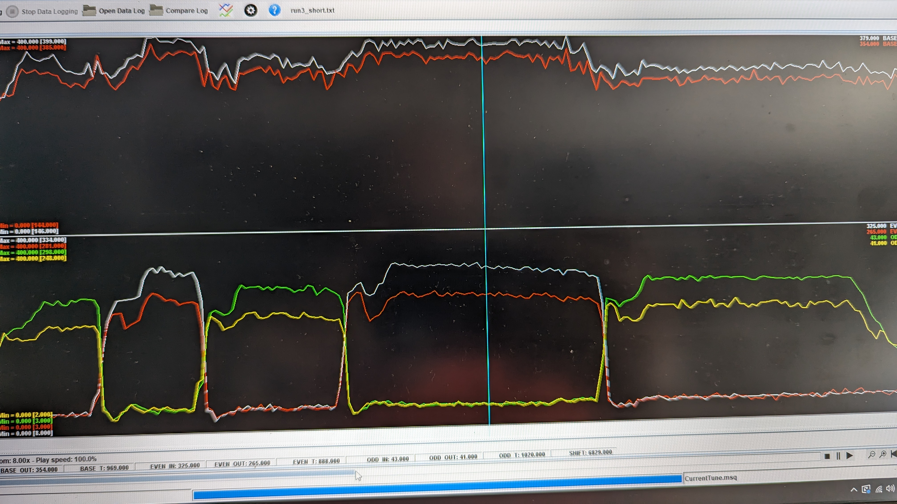
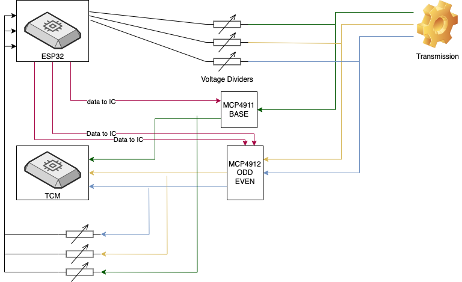
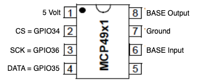
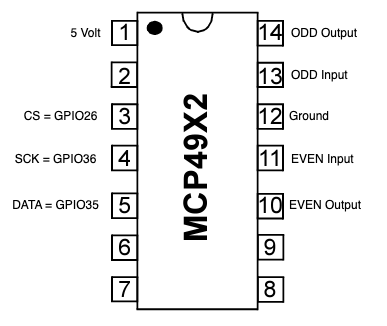
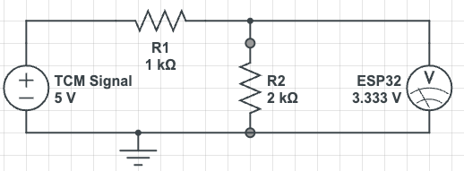
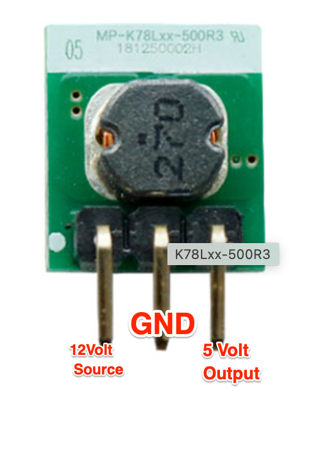
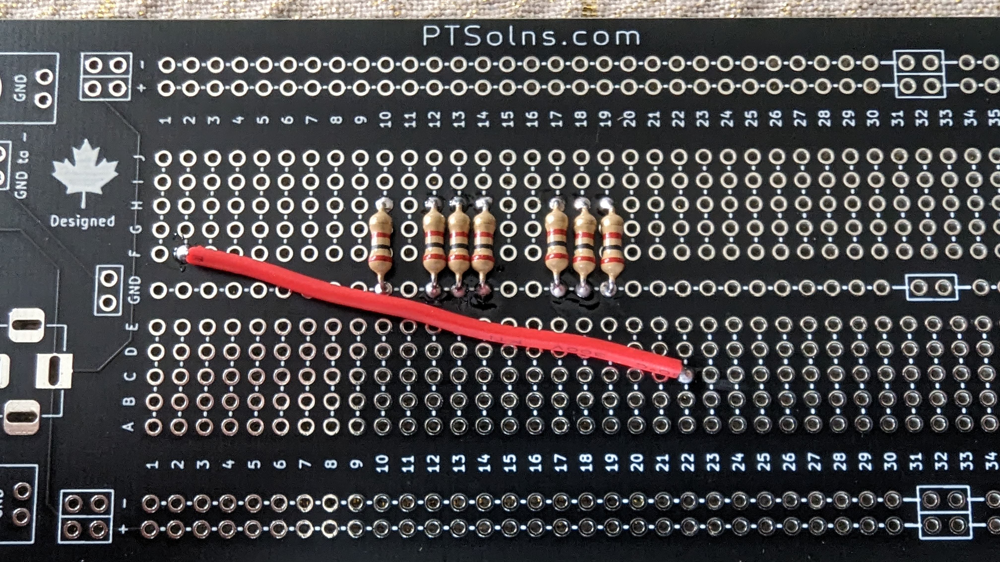
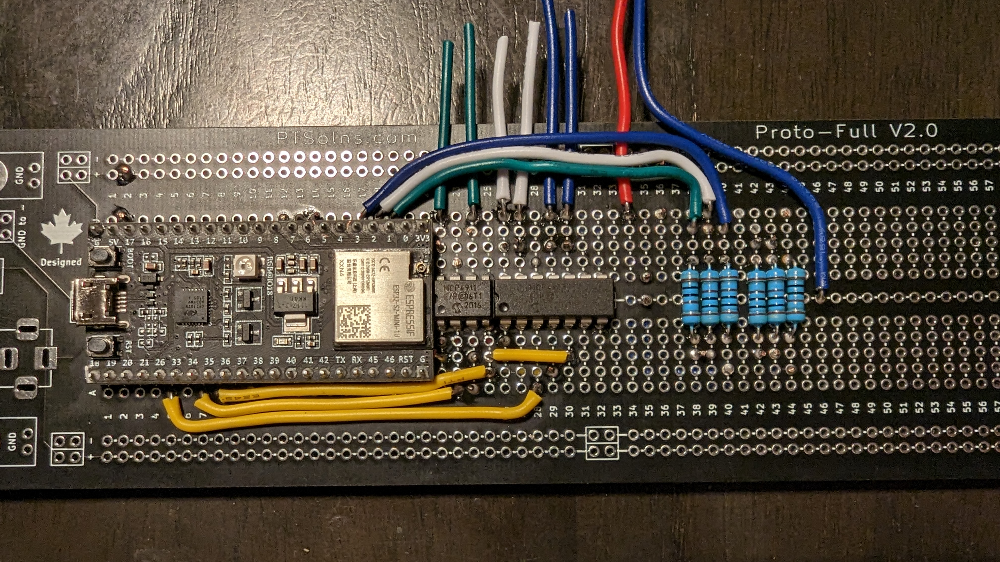
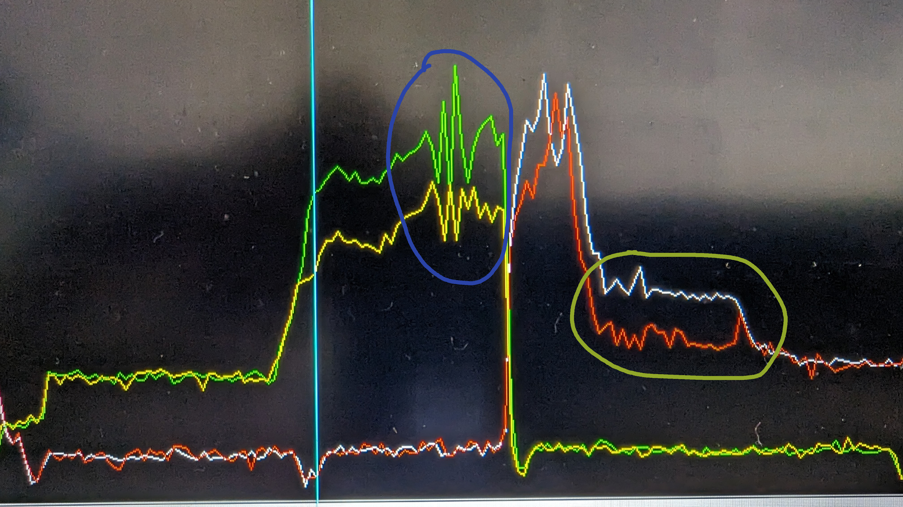
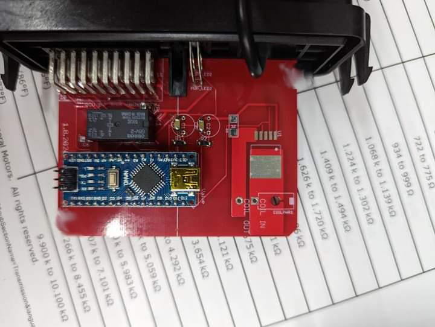

# C8 Clutch Pressure Controller - IG  @oz_tt_c8

Have you encountered a situation where you require additional clutch pressure?\
Have you attempted using aftermarket clutch pressure controllers without success?\
Do you want to try something before HPTuners releases support for C8 TCM? \
Are you electronically competent ?

Well this writeup is for you...

I will **not**  show you how to
* Get to TCM (there are plenty of directions out there)
* How to depin TCM Connector A (96pin)
* How to tap into 12V at TCM
* Where to place your newly built device

&nbsp;

**How does it work**\
The signals from pressure sensors in the transmissions are intercepted, and subsequently, these pressures are read and fed into MCP-DACs. At this stage, our code will determine whether the signal can be directly transmitted to the TCM or if it needs to be adjusted within the MCP-DAC before being passed on to the TCM.

We will be handling three pressure sensors: one for the base transmission pressure and two for the clutch pressures - one for odd gears and the other for even gears.

&nbsp;

This is what we want...  ~25% extra clutch pressure, holding 12psi of boost .. YELLOW is what TCM sees when in ODD gear and GREEN is the actual pressure.  Same goes with white/red.. BASE pressure on TOP.

&nbsp;

&nbsp;

**Hardware**
* ESP32 S2        <<<< i will be using ESP32-S2-Saola-1, please dont use AMAZON knockoffs
* 6x 2k Resistors
* 6x 1k Resistors
* MCP4911-E/P
* MCP4912-E/P
* K78L05-500R3    <<< or somekind of 5V regulator
* 3x TE 1670146-1 <<< pins for TCM connector (will have to cut off insolation part)
* Prototyping solderable breadboard, i use PTSolns off Amazon

*Everything on above list can be purchased on digikey.com*

&nbsp;

**Software**
* Visual Studio Code
* PlatformIO

&nbsp;

**Code Folders :file_folder:**

| Folder      | Description |
| ----------- | ----------- |
| logger      | Contains code you should test your board with.  This will output pressures IN and OUT of MCP-DAC.  It should always match.  You can also use this project to fine tune your ZERO bar reading.       |
| main        | As name suggests, main ESP32 code which will work with this write up.        |
| main_with_SD_log   | Same as main, but it adds support for SD Card logging and deep sleep mode via UP SHIFT signal from TCM.        |

&nbsp;

**Important :warning:**
* All signals in question are 5V, but ESP32 operates on 3.3V and it is not 5V tolerant.  That is where resistors come in play.  I will take all signals and run them thru voltage dividers
* Code will read values **before** and **after** MCP-DAC.  This will allow us to log, compare and debug.
* Following 3 pins will need to be depined on TCM Connector A (96 pin).  Pin 1 (green/blue), Pin 3 (yellow/black) and Pin 5 (white/brown).
* I will refer to Pin 1 signal as **EVEN**, Pin 3 as **BASE** and Pin 5 as **ODD**.
* The TCM periodically wakes up to check on sensors, which makes powering on with the key not feasible. To address this, we have a few options to consider. The first option is to keep the device always on, consuming 27mA of power. The second option is to put the device in a half-sleep mode, which consumes 17mA of power. The third option is to place the device into DEEP sleep mode if the signals remain at 0 for 5 seconds, and we can use the Up Shift signal to wake it up, utilizing the RTC and consuming 7mA of power.
* If you decide to use flash memory or PSRAM. :bangbang: :bangbang: You can NOT use GPIO/PIN 26, use 21 next to it. :bangbang: :bangbang:

&nbsp;

**ESP32 S2 PINOUT used in this document and code**

I will be using following GPIO

GPIO1 = BASE Input\
GPIO2 = ODD Input\
GPIO3 = EVEN Input

GPIO6 = BASE Output\
GPIO7 = ODD Output\
GPIO8 = EVEN Output

**Basic Diagram**

$${\color{red}Depending \space on \space your \space wiring \space and \space rest \space of \space setup, \space you \space might \space need \space to \space add \space some \space filtering \space on \space signal \space side}$$

&nbsp;

**Understanding MCPs**

This information is also available on ICs datasheets. **Important** I have also noted ESP *GPIO* to be used with pins.  This is how you 'wire' it.

&nbsp;

Using MCP49x1 as example, signal from Transmission is fed into **BASE Input** pin 6 and outputed to TCM via pin 8 **BASE Output**.\
The actually functionality of IC is controlled via SPI.

&nbsp;

&nbsp;

**Voltage Dividers**

&nbsp;

**5 Volt Regulator**

&nbsp;

# Basic Board Layout

In this pic we can see 5Volt jump wire from ESP to ICs.  Also 2K Resistors presoldered before we put ESP32 on board. (ignore hole 10 resistors)

ESP32 and MCP-DACs on board

SPI wires, 1k resistors with jumper wires to GPIO1/2/3, power wires where regulator would go.  I also ran other wires on other side of board, to balance out mess of wires.

**At this point you should have an idea on what needs to be soldered and to what points.  Its called out above**

&nbsp;

&nbsp;

## Apendix

*1.0 - Reading logs*

Blue - This is what happens if you start to modify BASE pressure while clutch pressure was already modified.  Clutch and Base should always go together

Yellow - This is what happens if your trigger/gate pressure is set to LOW.  In this case, i let go off the gas but signal was still being modified. Variable *_clutchGate* is to LOW in code.

&nbsp;

&nbsp;

*1.1 - Expected Result - 25% extra pressure holding 12psi of boost* .. YELLOW is what TCM sees when in ODD gear and GREEN is the actual pressure.  Same goes with white/red

&nbsp;

&nbsp;

*2.0 - Simular devices using Arduino Nano and different approach*

## Instagram @oz_tt_c8

