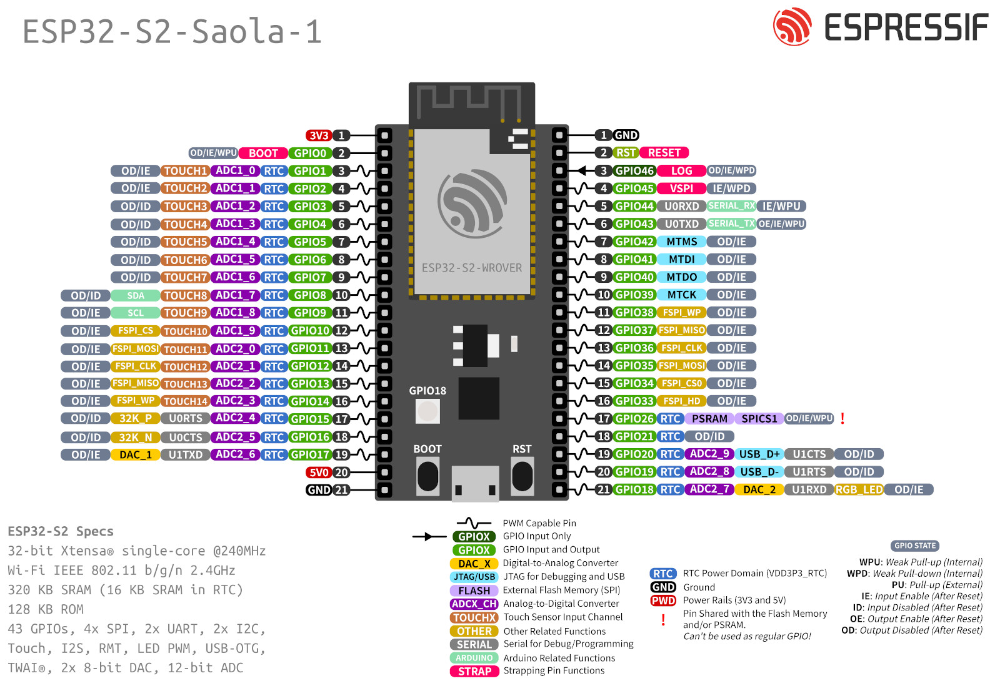
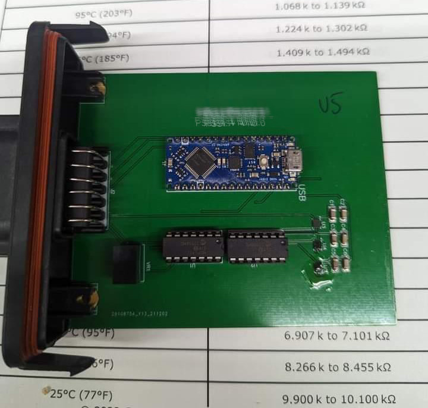

# C8 Clutch Pressure Controller

Have you run into an issue where you need more clutch pressure?\
Have you tried aftermarket clutch pressure controllers with no luck?\
Do you want to try something before HPTuners releases support for C8 TCM? \
Are you electronically competent ?

Well this writeup is for you...\
I will show you how to build it, and provide you with code which you can use as starting point.

I will **not**  show you how to
* Get to TCM (there are plenty of directions out there)
* How to depin TCM Connector A (96pin)
* How to tap into 12V at TCM
* Where to place your newly built device

**How does it work**\
I will take a pressure signal from Base, Odd and Even sensors located in Transmission.  Read those pressures and also feed them into MCPs.  At this point, our code will make a decision if signal can be passed along into TCM or if it needs to be modified in MCP before its passed along to TCM.

**Hardware**
* ESP32 S2        <<<< i will be using ESP32-S2-Saola-1, please dont use AMAZON knockoffs
* 6x 2k Resistors
* 6x 1k Resistors
* MCP4911-E/P
* MCP4912-E/P
* K78L05-500R3    <<< or somekind of 5V regulator
* 3x TE 1670146-1 <<< pins for TCM connector (will have to cut off insolation part)
* Prototyping solderable breadboard, i use PTSolns off Amazon

*Everything on above list can be purchased on digikey.com*

**Software**
* Visual Studio Code
* PlatformIO

**Important**
* All signals in question are 5V, but ESP32 operates on 3.3V and it is not 5V tolerant.  That is where resistors come in play.  I will take all signals and run them thru voltage dividers\
* I will read values **before** and **after** MCP.  This will allow us to log, compare and debug.\
* Following 3 pins will need to be depined on TCM Connector A (96 pin).  Pin 1 (green/blue), Pin 3 (yellow/black) and Pin 5 (white/brown).\
* I will refer to Pin 1 signal as **EVEN**, Pin 3 as **BASE** and Pin 5 as **ODD**.\
* TCM has a habit of waking up and checking on sensors every so often.  Which means, power on with key on is a not an option.  We have few options to work around this.  First, leave device always on (27mA). Second, put device in half sleep (17mA).  Third, put device into DEEP sleep if signals are reading 0 for 5 seconds, and use Up Shift signal wake it up(via RTC at 7mA).

**ESP32 S2 PINOUT i will be using**

I will be using following GPIO

GPIO1 = BASE Input\
GPIO2 = ODD Input\
GPIO3 = EVEN Input

GPIO6 = BASE Output\
GPIO7 = ODD Output\
GPIO8 = EVEN Output

**Basic Diagram**

$${\color{red}Depending \space on \space your \space wiring \space and \space rest \space of \space setup, \space you \space might \space need \space to \space add \space some \space filtering \space on \space signal \space side}$$

**Understanding MCPs**

This information is also available on ICs datasheets. I have also noted which *GPIO* is to be used with pins.

**Voltage Dividers**

**5 Volt Regulator**

# Basic Board Layout

In this pic we can see 5Volt jump wire from ESP to ICs.  Also 2K Resistors presoldered before we put ESP32 on board. (ignore hole 10 resistors)

ESP32 and MCPs on board

SPI wires, 1k resistors with jumper wires to GPIO1/2/3, power wires where regulator would go.  I also ran other wires on other side of board, to balance out mess of wires.

**At this point you should have an idea on what needs to be soldered and to what points.  Its called out above**

# Apendix

Simular devices using Arduino Nano

